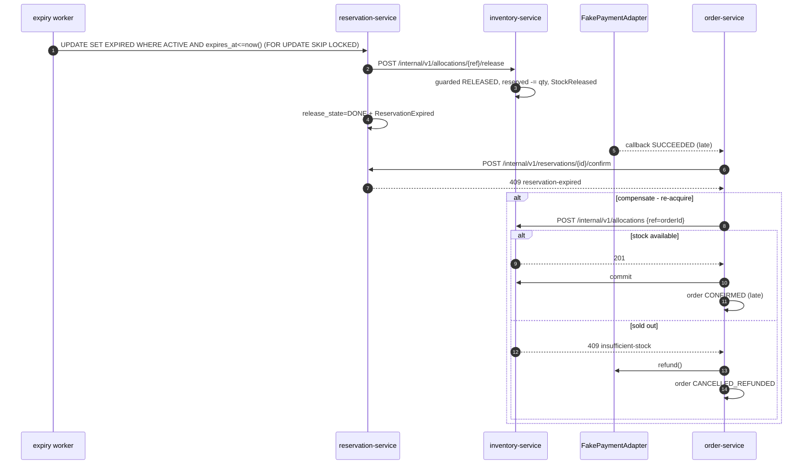

# Flash Sale Inventory Reservation

Three independently deployable Spring Boot services, each owning its own
PostgreSQL database, coordinating over HTTP. Overselling is structurally
impossible.

## Run

    docker compose up --build       # four containers, healthcheck-gated
    ./seed.sh                       # creates data, prints ready-to-use JWTs

| Service | Port | Owns |
|---|---|---|
| inventory-service | 8081 | products, per-warehouse stock, allocate/release/commit |
| reservation-service | 8082 | TTL holds, idempotent reserve |
| order-service | 8083 | orders, async fake payment |

OpenAPI: http://localhost:8081/swagger-ui.html (and 8082, 8083).

## Service boundaries are enforced, not promised

Each service gets its own database **and its own database user**, granted only on
its own database. `res_user` physically cannot read `stock_items`:

    $ docker compose exec postgres psql -U res_user -d inventory_db -c "SELECT 1;"
    FATAL: permission denied for database "inventory_db"

Captured in `docs/evidence/cross-db-denied.txt`.

## Concurrency

Allocation is a single conditional UPDATE that re-checks availability in its own
WHERE clause:

    UPDATE stock_items
       SET reserved = reserved + :qty
     WHERE id = :id AND tenant_id = :tenantId
       AND on_hand - reserved >= :qty;

Under READ COMMITTED, Postgres re-evaluates that predicate against the newly
committed row after acquiring the row lock (EvalPlanQual), so a concurrent writer
causes the predicate to fail rather than a lost update. `available` is always
derived as `on_hand - reserved`, never stored.

Database CHECK constraints (`on_hand >= reserved`, both non-negative) are the
structural backstop: a bug becomes a constraint violation, not corrupt stock.
Full reasoning in `docs/adr-001-locking.md`.

## Idempotency — two layers

1. **reservation-service** — `Idempotency-Key` header. Insert-first claim
   (ON CONFLICT DO NOTHING); a completed record replays its stored response, an
   in-flight duplicate gets 409, and the same key with a different payload gets 422.
2. **inventory-service** — UNIQUE (tenant_id, allocation_ref). This is what makes
   an HTTP retry safe: if reservation-service times out but the allocation
   actually committed, the retry returns the existing allocation instead of
   allocating twice. Retry on the inventory call is enabled *because* of this.

## Expiry

TTL default 10 minutes. A background worker claims expired rows with
FOR UPDATE SKIP LOCKED, so N instances run concurrently with no coordination —
ShedLock is on the allowed list but unnecessary here. Releases that fail are
retried by a second pass keyed on `release_state`, a mini-outbox without a broker.

Expiry is not on-read. But confirm is still an atomic gate
(... WHERE status='ACTIVE' AND expires_at > now()), which closes the window
between expires_at passing and the worker firing.

**Leak recovery:** every allocation carries a lease (reservation TTL + grace).
If reservation-service dies between "allocate succeeded" and "reservation saved",
inventory's own sweeper releases the orphan. Inventory protects its invariant
without knowing reservation-service exists.

## Late payment

The reservation TTL is **absolute and never extended** — it is a promise to other
buyers. A payment landing after expiry triggers compensation: attempt a fresh
allocation under ref = orderId; fulfil if it succeeds, refund and cancel if the
stock has genuinely sold out. An allocation that no longer exists is never
committed.

*Rejected alternative:* extending the hold at order creation. A stuck payment
would then pin stock indefinitely.

## Multi-tenancy

JWT HS256 (production would use RS256 + JWKS), claims `tenantId` and `roles`.
Tenant is an explicit parameter in **every** repository method and the leading
column of every unique constraint — not a Hibernate @Filter. See "bugs found"
below for why.

Internal endpoints require ROLE_SERVICE. Services mint a short-lived service
token carrying the caller's tenant; the user's own token is never forwarded.
Without this a USER could call /internal/v1/allocations directly and drain stock
with no reservation. Tested.

Cross-tenant access returns **403** per the brief. 404 would leak less
information; I followed the spec.

## Domain events

StockReserved, StockReleased, StockCommitted, ReservationCreated,
ReservationExpired, ReservationConfirmed, OrderCreated, OrderConfirmed,
OrderCancelled, PaymentSucceeded/Failed/Refunded.

Written in the same transaction as the state change, so there is no dual-write
problem. Each service exposes GET /api/v1/events, tenant-scoped. The table
carries a `published_at` column it never sets — it is outbox-shaped on purpose,
so adding a broker later means adding a relay poller, not a migration.

## Tests, and why these ones

Run: `docker compose up -d postgres && ./mvnw test`

| Test | What it proves |
|---|---|
| OversellConcurrencyTest | 300 concurrent allocates against 100 units, x5 repetitions: exactly 100 succeed, 200 get 409, reserved == 100, available == 0. Repeated because races are probabilistic |
| DoubleReleaseTest | 8 concurrent releases decrement reserved exactly once. Double-release is the sneakiest oversell path and almost nobody tests it |
| TenantIsolationTest | Two tenants owning the **same SKU string**. Draining A must not touch B. This separates real query filtering from controller theatre — and it caught a live bug |
| SecurityTest | 401 unauthenticated; USER and ADMIN both 403 on /internal/**; USER 403 on admin; actuator open; errors in RFC 7807 shape |

## Three bugs these tests found

1. **Tenant isolation was not actually enforced.** The Hibernate @Filter was
   enabled by an MVC interceptor, which silently no-ops with open-in-view: false
   — no session exists at that point. Tenant B could read tenant A's products.
   Replaced with explicit tenantId parameters in every query. TenantIsolationTest
   is what surfaced it.
2. **Null correlation-id header threw on non-request threads.** The inventory
   client read MDC.get("correlationId"), which is null on scheduler and worker
   threads, and the JDK HTTP client rejects null header values. Would have broken
   every retry and every background release in production.
3. **The expiry worker's @Transactional never applied.** run() called
   this.claimBatch(), bypassing the Spring proxy. The worker had never once done
   its job. Moved to a separate bean.

## What I deliberately left out

- **Automated idempotency and expiry tests.** Both cross a service boundary, so
  testing them properly needs WireMock or a Compose-based harness. Within the
  timebox I prioritised the concurrency tests, since oversell is the primary
  correctness risk. Both paths are verified manually — see docs/evidence/.
- **Testcontainers.** The bundled docker-java client is incompatible with Docker
  Engine 29.x on this machine; tests run against the Compose Postgres instead.
- **Outbox relay / broker.** The events table is already shaped for it.
- **Postgres Row-Level Security.** Would move tenant scoping below the
  application entirely; the strongest version of what I built.
- **API gateway, separate payment/catalog/event services.** Out of scope per the brief.

## Known limitations

- An idempotency key whose request crashes mid-flight stays locked as
  IN_PROGRESS; the client must use a new key. Production would expire those
  records after a timeout.
- /actuator/devtoken mints JWTs for local demo use. It exists so seed.sh and the
  reviewer can get working tokens in one command. **It would not ship** — a real
  deployment issues tokens from an identity provider.
- Local credentials are inlined in docker-compose.yml so the stack runs with one
  command. Nothing here is reused anywhere.

## Diagrams

### Reserve -> pay -> confirm

```mermaid
sequenceDiagram
  autonumber
  actor U as User (JWT tenant=T1)
  participant R as reservation-service
  participant I as inventory-service
  participant O as order-service
  participant P as FakePaymentAdapter

  U->>R: POST /api/v1/reservations + Idempotency-Key
  R->>R: claim idempotency key; INSERT reservation PENDING [commit]
  R->>I: POST /internal/v1/allocations {ref, sku, qty, expiresAt}
  I->>I: UPDATE stock_items SET reserved=reserved+qty WHERE on_hand-reserved>=qty
  I->>I: INSERT allocation(ref UNIQUE) + StockReserved [commit]
  I-->>R: 201
  R->>R: reservation ACTIVE, expires_at=now+TTL [commit]
  R-->>U: 201 {reservationId, expiresAt}

  U->>O: POST /api/v1/orders {reservationId}
  O->>R: GET /internal/v1/reservations/{id}
  R-->>O: 200 (ACTIVE, unexpired)
  O->>O: INSERT order PENDING_PAYMENT + payment_attempt [commit]
  O->>P: authorize()
  O-->>U: 202 {orderId, PENDING_PAYMENT}
  P-->>O: callback SUCCEEDED (0-5s, scheduler thread)
  O->>R: POST /internal/v1/reservations/{id}/confirm
  R->>R: UPDATE SET CONFIRMED WHERE ACTIVE AND expires_at>now()
  R-->>O: 200
  O->>I: POST /internal/v1/allocations/{ref}/commit
  I->>I: on_hand-=qty, reserved-=qty (available unchanged)
  O->>O: order CONFIRMED + OrderConfirmed
```

### Expire -> late payment


